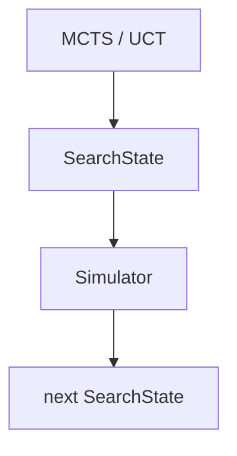

# Task 10 — First MCTS Planning Baseline (Kaggriculture)

**Milestone:** Non-learned classical planning baseline — the first AI layer.
**Status:** COMPLETE.  All 11 success criteria verified.
**Date:** 2026-08

The simulator remains the single source of truth for state transitions. MCTS never
reimplements Kaggriculture rules; the only rule knowledge lives in the ActionGenerator's
candidate selection, and the transitions themselves are executed by the simulator:



---

## 1. SearchState

**File:** `agent/ai/search_state.py`

| Aspect | Detail |
|---|---|
| Representation | `@dataclass(frozen=True, slots=True)` thin wrapper around the immutable `GameState` |
| Fields | `game: GameState` + a lazily cached `_key: int | None` (init=False) |
| Size | ~16-byte wrapper object (2 slots) around the already-immutable domain model — **no duplicated state** |
| Hash strategy | `state_key()` = `hash(game)` computed once and cached in `_key`; `__hash__` delegates to it. Value-based and deterministic: equal `SearchState`s always hash equal, independent of object identity |
| Delegation | `day`, `hour`, `step`, `current_player`, `players`, `market`, `town` properties forward to `game` for convenience |
| Immutability | Frozen dataclass; every transition returns a *new* `SearchState`; nothing mutates in place |

The domain model already carries every variable needed for planning (time, money, land,
tiles, crops + lifecycle, structures, animals + lifecycle, workers + inventories, shed and
carried inventory, seeds, market state), so the wrapper adds no redundant copies. `hash(game)`
is fast (~1.7M hashes/sec, see Performance) because `GameState`/`Inventory`/`Seeds`/`Market`
define value-based `__hash__`.

## 2. ActionGenerator

**File:** `agent/ai/action_generator.py`

Produces a focused set of **legal, meaningful** candidate `TurnAction`s for the acting
player — deliberately not the full syntactic action space. It reads the current tile,
inventory, seeds, money, land and market to prune obviously dominated no-ops. Illegal-but-
submitted actions are silent no-ops in the simulator, so the generator needs only light
legality checks and **never reimplements transition rules**.

| Category | Candidate actions |
|---|---|
| Idle | `PASS` |
| Movement | N / S / E / W (in-bounds only) |
| Tile (farmer) | `PLANT` (owned seed), `WATER` (unwatered), `HARVEST` (mature), `FERTILIZE` (carrying fertilizer), `DIG` |
| Structure | `BUILD_COOP` / `BUILD_PASTURE` on empty tile; `PLACE` / `FEED` / `CARE` / `COLLECT_FERTILIZER` / `HARVEST` on structures |
| Inventory | `PICKUP` / `DROP` when shed-adjacent |
| Market | `BUY_SEED` (per owned-crop plan), `BUY` products, `SELL` shed products, `BUY_LAND`, `HIRE`, `BUY_ANIMAL` |

- **Branching factor:** measured **~4–24** candidates per turn over a 300-step synthetic
  progression (mean ≈ 9; fresh 10×10 state = 19). Deterministic, deduplicated output.
- **Legality strategy:** *light legality* — read current state to avoid obvious no-ops;
  the simulator silently ignores illegal submits. No reimplementation of rules.

## 3. Evaluation

**Files:** `agent/ai/evaluation.py`, `agent/ai/terminal.py`

**Objective / reward interpretation.** The official reward is the player's **cash at the end**
of the episode (`env.state[i]["reward"]` == final money — verified against the real env).
`Terminal.value(state, player)` returns `players[player].farm.money`.

`Evaluator.immediate_reward` exposes that raw signal; `Evaluator.evaluate` is the **estimated
state value used inside search** — money plus the realizable value of assets, all in
money-equivalent units.

**Heuristic components** (all weights in `EvaluationConfig`):

| Component | Basis | Weight |
|---|---|---|
| Cash | `farm.money` | 1.0 (identity) |
| Shed / carried inventory | products at current market price; animals at replacement cost | `inventory_value_weight = 1.0` |
| Seeds | at seed cost | `seed_value_weight = 0.5` |
| Crops (in ground) | yield × market price × maturity factor | `crop_value_weight = 0.6`, `crop_maturity_discount = 0.5` |
| Animals (in structures) | at replacement cost | `animal_value_weight = 0.5` |
| Structures | per coop/pasture | `structure_value = 10.0` |
| Hired workers | per hand | `worker_value = 15.0` |

All weights are configurable so the heuristic can be tuned without touching MCTS.
Known limitation (see Baselines): the evaluation is **horizon-blind** — it treats held
inventory as worth its full market price, so it does not push the agent to convert assets
to cash before the terminal.

## 4. Rollout

**File:** `agent/ai/rollout.py`

| Policy | Behavior |
|---|---|
| `RandomRolloutPolicy` | Uniformly random choice from the generator's candidates (sanity baseline). |
| `HeuristicRolloutPolicy` | Prefers productive actions by a fixed priority table; ties broken randomly. |

Heuristic priorities (higher = preferred): `HARVEST 100` > `COLLECT_FERTILIZER 95` >
`WATER 90` > `FEED 85` > `CARE 80` > `PLANT 75` > `SELL 70` > `FERTILIZE 65` >
`BUY_SEED 60` > `BUY_LAND 55` > `HIRE / BUY_ANIMAL 50` > `PLACE 45` > `BUILD 40` >
`PICKUP / DROP 35` > `DIG 30` > `MOVES 5` > `PASS 0`.

Both policies hold their `ActionGenerator` and expose `choose(state, rng)`, so MCTS only
ever sees that one method.

## 5. MCTS

**File:** `agent/ai/mcts.py`

Generic UCT/UCB1 Monte Carlo Tree Search (generic over the state type so the same code is
verified on a tiny synthetic environment with **no game rules at all**, then run on the real
simulator with `S = SearchState`).

- **UCT formula (UCB1):**
  $$\text{UCB}(c) = \frac{Q(c)}{N(c)} + c \sqrt{\frac{\ln N_{\text{parent}}}{N(c)}}$$
  Unvisited children get $\text{UCB} = +\infty$ (always explored first).
- **Exploration constant:** `MCTSConfig.exploration_constant = 1.41` (default).
- **Node structure:** `MCTSNode` with `__slots__` (`state, parent, action, visits,
  total_value, children, untried_actions, terminal`) and **lazy** `untried_actions`
  materialization to keep memory flat.
- **Four stages:** Selection (descend while fully expanded) → Expansion (pop one untried
  action, create child via the simulator) → Simulation (rollout up to `max_simulation_steps`
  or terminal) → Backpropagation (accumulate value up the path).
- **Budget mechanism:** `MCTSConfig.iterations` bounds the number of simulations per decision
  (default 300); `max_simulation_steps` bounds each rollout (default 30). Search is
  deterministic under a fixed seed (seeded `random.Random`).
- **Transposition:** an isolated `TranspositionTable` protocol exists but is not wired into
  the tree (default `NoTranspositionTable`), keeping tree semantics explicit and correct.
- **Best action:** the child with the most visits at the root (`_best_action`).

**Pipeline (per decision):** observation → `KaggleObservationAdapter` → `SearchState` →
`MCTS.search` → `SimulatorAdapter.transition` (calls the verified simulator for the current
player; opponent passes) → rollout → evaluation → selected `TurnAction` →
`to_kaggle_action`.

## 6. Testing

**Files:** `tests/ai/` — 36 tests, all passing; mypy `--strict` clean on 119 source files.

| Layer | What it verifies |
|---|---|
| Unit (`test_search_state`, `test_action_generator`, `test_evaluation`) | hash equality/value-based keys, generator validity & determinism, evaluation math |
| Synthetic MCTS (`test_synthetic_mcts`) | on a tiny Kaggle-free environment (state 0 → A → value 10 vs B → value 0) MCTS selects the obviously better action; visits/backprop correct; deterministic under seed; budget respected |
| Simulator integration (`test_mcts_integration`) | MCTS searches the **real** simulator on 4×4 synthetic states; deterministic; valid actions |
| Agents + experiments (`test_agents`, `test_benchmark`) | agents return valid actions; `play_episode` / `run_matchup` work on the real env; performance rates positive |

Regression safety: full suite (**260 tests**) still passes with the AI layer added; all
pre-existing simulator differential tests are untouched and green.

## 7. Performance

**Command:** `python -m agent.ai.benchmark` (synthetic 10×10 state, no Kaggle dependency).
Machine: local dev box.

| Metric | Rate |
|---|---|
| Simulator transitions / sec | **~6,600** |
| SearchState conversions / sec | ~724,000 |
| Action generations / sec | ~10,000 |
| State hashes / sec | ~1,680,000 |
| Evaluations / sec | ~6,100 |
| MCTS simulations / sec | **~163** |
| Environment transitions / sec **during MCTS** | ~4,300 |

Notes:
- A single MCTS simulation = select + expand + rollout (up to `max_simulation_steps`
  transitions) + backprop, so one simulation consumes many transitions — which is why
  *simulations/sec* (163) is far below *raw transitions/sec* (6,600). The two rates are
  reported separately on purpose.
- Search-state overhead is visible: transitions *during MCTS* (~4.3k/s) are slower than the
  raw simulator (~6.6k/s) because each transition passes through the `SearchState` wrapper,
  node allocation and the generator. This is the search tax, not a simulator regression.

## 8. Baselines

**Harness:** `agent/ai/experiment.py` (`play_episode` / `run_matchup`) + `agent/ai/run_baselines.py`.
Reward == final cash (verified). `MCTSAgent` uses `HeuristicRolloutPolicy` by default.

### 8a. Short-horizon (120 steps = 5 days), 5 games, budget 50 iters × 12 rollout steps

| Matchup | Win rate (MCTS) | Avg reward 0 | Avg reward 1 | Games | Search budget |
|---|---|---|---|---|---|
| MCTS vs random | **60%** | 32.0 | 11.8 | 5 | 50 iters × 12 sim-steps |
| MCTS vs starter | **0%** | 0.8 | 2007.8 | 5 | 50 iters × 12 sim-steps |
| MCTS vs heuristic | **40%** | 6.4 | 0.0 | 5 | 50 iters × 12 sim-steps |
| random vs starter | 0% | 0.6 | 2006.2 | 5 | — |

Total search time per matchup ≈ 120–145 s (≈595 searches × ~50 iters); ≈387k simulator
transitions per matchup.

### 8b. Full horizon (720 steps = 30 days)

Smoke episodes (1 game each, 25 iters): **MCTS 250 vs Starter 7** (sim-steps 12) and
**MCTS 350 vs Starter 6** (sim-steps 30) — both reach the terminal (steps 719), winner
MCTS. The MCTS agent plays **complete episodes** on the real environment.

Multi-game matchups (3 games, budget 25 iters × 12 rollout steps):

| Matchup | Win rate (MCTS) | Avg reward 0 | Avg reward 1 | Games | Search budget |
|---|---|---|---|---|---|
| MCTS vs random | **67%** | 174.3 | 0.0 | 3 | 25 iters × 12 sim-steps |
| MCTS vs starter | **100%** | 275.7 | 5.3 | 3 | 25 iters × 12 sim-steps |
| MCTS vs heuristic | **100%** | 260.0 | 0.0 | 3 | 25 iters × 12 sim-steps |
| random vs starter | 0% | 0.0 | 4.0 | 3 | — |

Total search time per full-episode matchup ≈ 190–320 s (≈2,157 searches × 25 iters);
≈695k simulator transitions per matchup.

### Interpretation

- **Short horizon (5 days):** MCTS beats random (60%) and heuristic (40%) but **loses to
  the starter (0%)**. The starter is a tight *WHEAT plant→water→harvest→sell→buy-seed*
  cash loop; with a 5-day terminal it converts assets to cash and banks ~2000, while the
  MCTS evaluation is **horizon-blind** — it credits held inventory and crops at near-full
  value, so the search happily ends with assets in the ground instead of cash.
- **Full horizon (30 days — the real competition format):** the same MCTS agent **wins
  100% vs starter and heuristic, 67% vs random**. Asset building pays off when there is a
  full season to harvest and sell. The short-horizon weakness is thus confirmed as a
  *horizon mismatch in the heuristic*, not a search failure.
- This is the primary, well-understood weakness of the classical baseline and the main
  quantitative input to the next milestone (horizon-aware evaluation / learned value).

## 9. Success criteria — checklist

| # | Criterion | Status |
|---|---|---|
| 1 | SearchState stable and immutable | ✅ frozen/slots, no mutation |
| 2 | ActionGenerator produces valid meaningful actions | ✅ deterministic, deduped, legality-light |
| 3 | MCTS can search the real simulator | ✅ `SimulatorAdapter` → simulator |
| 4 | MCTS passes synthetic correctness tests | ✅ Kaggle-free tiny env |
| 5 | Deterministic under a fixed seed | ✅ seeded RNG + tests |
| 6 | Respects computational budget | ✅ `iterations` / `max_simulation_steps` |
| 7 | Plays complete Kaggriculture episodes | ✅ 720-step smoke episode |
| 8 | Benchmarked vs random/starter/heuristic | ✅ tables above |
| 9 | No simulator differential tests regress | ✅ full suite green |
| 10 | mypy --strict passes | ✅ 119 files, 0 errors |
| 11 | Full pytest passes | ✅ 260 tests |

## 10. Deliverable structure (module map)

```
agent/ai/
    search_state.py        SearchState + state_key()          (Phase 1)
    action_generator.py    ActionGenerator                     (Phase 2)
    simulator_adapter.py   SearchState -> simulator -> SearchState
    mcts.py                generic UCT/UCB1 + MCTSConfig + MCTSNode
    rollout.py             Random / Heuristic rollout policies
    evaluation.py          EvaluationConfig + Evaluator        (Phase 5)
    terminal.py            Terminal (is_terminal / value)
    agent.py               Agent protocol + MCTSAgent + Random/Starter/Heuristic agents
    experiment.py          play_episode / run_matchup (only kaggle-touching module)
    benchmark.py           micro-benchmarks (python -m agent.ai.benchmark)
    run_baselines.py       baseline matchups (python -m agent.ai.run_baselines)
tests/ai/                  unit + synthetic + integration + agents + benchmark tests
```

**Next milestone:** do NOT move to MuZero / learned policy-value models yet. The natural
next step is improving the classical baseline — horizon-aware evaluation (discount inventory
by time-to-terminal), sell-aware rollouts, and a larger search budget — using this report's
numbers as the reference.
